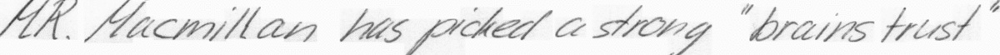
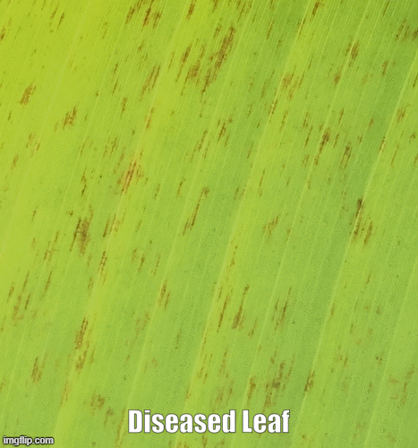
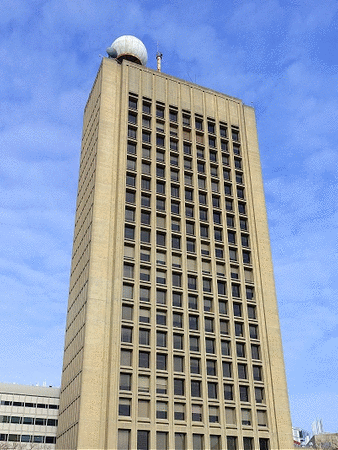

Hi there, thanks for stopping by. I am Siddhant Kapil, a curious Software Developer who likes to explore new technologies and use them to solve challenging real-world use cases. I am highly experienced in designing algorithms and backend development, and fairly experienced in frontend developement. I am also honing my skills in the field of Machine Learning and Data Science.

### A Little More About Me

I am a first-year graduate student at UMBC pursuing MS in Computer Science. My estimated graduation date is May 2021. As of now, I am holding a GPA of 4. My primary areas of interest are Algorithms and Machine Learning. At UMBC, I am working as a Research Assistant for Prof. David Chapman on design a novel deep learning algorithm for generating images similar to the input images. 
Before joining UMBC, I used to work as a Senior Associate at Nagarro Software Pvt. Ltd. where I contributed in designing various Software Engineering and Machine Learning projects. My day-to-day at Nagarro was to work closely with ML experts and design data processing pipelines for large-scale Machine Learning systems.  

### Expertise
* ___Programming Languages:___ Python, C#, C/C++, Java, JavaScript, MATLAB, GoLang.
* __Technologies:__ REST, Celery, Tensorflow.js, pySpark, NumPy, SciPy, Selenium, GIT, jQuery, Docker.
* __Tools and Frameworks:__ AGILE, Django, Flask, Wrangler(Cloudflare).
* __Research Areas:__ Algorithms, Big Data and Machine Learning.
* __Databases:__ MongoDB, MySQL, SQL Server
* __Cloud:__ Amazon Web Services, Google Cloud Platform

### PortFolio

### AI & Algorithms

#### a) Industrial Projects

  __1) Deslant Cursive Handwritten Text in Images:__

   * __Problem:__ One of the challenges in performing OCR on handwritten text is the slanting text. It should be corrected otherwise it may affect the text detection or word cropping in some cases. 
   * __Solution:__ To solve this I devloped an Image Processing Algorithm completely from scratch. This algorithm first calculate the slantinf factor of the text and then the translate the image using that slanting factor to deslant it.
   * __Result:__ On my custom dataset this algorithm increased the word slicing accuracy by 9% and overall detection accuracy by 6%.
   * __Skills Used:__ Algorithms, Python, OpenCV, Matrix Manipulation, Image Processing.
   * __Code:__ https://github.com/SiddhantKapil/deslant_cursive_images
   
  
  
  __2) Sigatoka Detection:__
   * __Problem:__ Sigatoka is a disease found in banana leaves. It starts with a few brown spots and eventually results in decaying of the leaves.
   * __Solution:__ I used techniques like Automatic Cropping, and Perspective Transformation to crop banana leaves. Then I used Color Segmentation, Contours Extraction, and Color Correction using Gold Standards to extract out potential sick spots. Then I used Spatial Clustering, Denoising Algorithms and Contours Manipulation to remove false positives.  
   * __Skills Used:__ Algorithms, Python, OpenCV, Matrix Manipulation, Image Processing.
   * __Code:__ https://github.com/SiddhantKapil/SigatokaDetection
  
 
 
  __3) Detect Keypoints in Images:__

   * __Problem:__ Facial keypoints detection find its use in apps like Snapchat, Instagram filter, What's your age or Gender.
   * __Solution:__ To do it I made a short and sweet neural netowrk using  Keras to detect important Facial Features. I also used Data Augmentation techniques like flipping the image to increase data samples.
   * __Skills Used:__ Python, Keras, Neural Networks Image Processing.
   * __Code:__ https://github.com/SiddhantKapil/Facial-Keypoints-Detection
   
#### b) Some other interesting Projects

  
  
   __1) Implemented RANSAC for Line Detection:__
   * __Overview:__ Implemented RANSAC from scratch using C without OpenCV.
   * __Result:__ Shown in the GIF above. Highlighted top 5 prominent lines in blue color.
   * __Skills:__ C, Algortihms, Matrix Manipulation, Edge Detection, RANSAC, Image Processing.
   * __Code:__ https://github.com/SiddhantKapil/RANSAC_In_C
   
   
   
   __2) Implemented RANSAC and ORB for Feature Matching:__
   * __Overview:__ Implemented RANSAC and ORB from scratch using C++. Used OpenCV only for calculating features, reading inputs and saving outputs.
   * __Result:__  Dragging the mouse over the video will crop a part. When the color of the bounding box is red that means the user s still dragging the mouse. Once mouse dragging is complete, the bounding box color turns green and the image is cropped. In the upcoming frames, the cropped image is tracked and represented by green bounding box.
   * __Skills:__ C, Algortihms, Matrix Manipulation, Edge Detection, RANSAC, Image Processing, Feature Matching, ORB Detection.
   * __Code:__ https://github.com/SiddhantKapil/FeatureMatchingFromScratch
   
### Data Science

   __1) EDA on Open Baltimore Datasets__
* __Overview:__ Performed EDA on two datasets. 1) Analyzing trends of CityTax w.r.t. Area, Lot Size, Block. 2) Analyze 911 calls frequency and severity w.r.t time of the day.
* __Code:__  https://github.com/SiddhantKapil/EDAonOpenBaltimore/blob/master/EDA%20on%20Baltimore%20Residences.ipynb,  https://github.com/SiddhantKapil/EDAonOpenBaltimore/blob/master/EDA%20and%20PredictiveModelling%20for%20911%20calls.ipynb

### Software Development

   __1) Simulating Distributed System Environment using PDA processors__

* __Overview:__ To showcase my knowledge about dstributed OS,I made a dummy project in which I am using PDAs as ditributed servers and applying various techniques like caching, cookies, replica groups, CRUD operations on PDAs and replica groups.
* __Skills:__ Go, RESTful.
* __Code:__ https://github.com/SiddhantKapil/RESTfulExample
   
   
